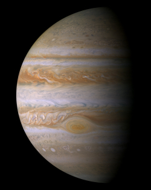
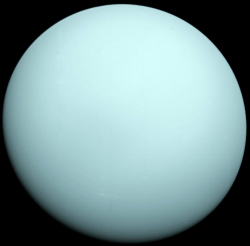
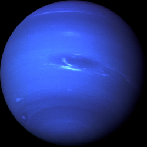

<small>Click on an object to jump to it:</small>

<map name="navigation">
    <area shape="rect" coords="0,0,168,634" href="#our-sun" title="Our Sun" alt="Our Sun" />
    <area shape="circle" coords="218,315,27" href="#mercury" title="Mercury" alt="Mercury" />
    <area shape="circle" coords="324,315,39" href="#venus" title="Venus" alt="Venus" />
    <area shape="circle" coords="464,315,50" href="#earth" title="Earth" alt="Earth" />
    <area shape="circle" coords="508,256,13" href="#the-moon" title="The Moon" alt="The Moon" />
    <area shape="circle" coords="604,315,35" href="#mars" title="Mars" alt="Mars" />
    <area shape="rect" coords="700,95,1000,532" href="#jupiter" title="Jupiter" alt="Jupiter" />
    <area shape="rect" coords="1060,220,1350,420" href="#saturn" title="Saturn" alt="Saturn" />
    <area shape="circle" coords="1500,315,98" href="#uranus" title="Uranus" alt="Uranus" />
    <area shape="circle" coords="1710,315,74" href="#neptune" title="Neptune" alt="Neptune" />
    <area shape="default" nohref="nohref"/>
</map>

There are two basic types of planets, Earth-like ("terrestrial") planets and Jupiter-like ("Jovian") planets. The terrestrial planets are Mercury, Venus, Earth and Mars. They are small, dense, rocky worlds. They are located in the inner part of the Solar System, they have solid surfaces, just a couple moons at most, rotate slowly, and have no rings around them.

The Jovian planets are Jupiter, Saturn, Uranus and Neptune. They are large planets located in the outer part of the planetary realm of the Solar System. The Jovian planets are gas giants—large objects made mostly of hydrogen and helium. They are much larger than terrestrial planets. They are rapidly rotating objects. They all have rings, and extensive families of moons. They have no solid surface on which to stand, and the apparent visible surfaces are just the top layers of clouds in their atmospheres. Deeper in their atmospheres, the gases get thicker and thicker, until finally they turn into a liquid. At their centers, they may have a solid, rocky core a few times the size of Earth.

## Our Sun

The Sun is at the center of the Solar System. The planets, asteroids and comets all revolve around the Sun. The Sun’s role as the center of the planetary system comes from its high mass; it has 99.8% of the mass in the Solar System. The Sun is a star.

### Quick Facts

Type|Star|G2V
Luminosity|3.83 x 1033 ergs/sec|
Visual Brightness (V)|-26.74|
Absolute Magnitude|4.83|
Composition|92.1% Hydrogen, 7.8% Helium|
Temperature|5,504 °C|5777 K
Mass|1.989 x 1030 kg|333,060.402 x Earth
Equatorial Radius|695,508 km|109.2 x Earth|
Gravity|274.0 m/s2|
Escape Velocity|2,223,720 km/h|6.177 x 105 m/s
Mean Rotation Period|25.38 Earth Days|609.12 Hours
Age|4.6 Billion Years|

# Terrestrial Planets:

## Mercury

Mercury is the closest planet to the Sun and smallest of the terrestrial planets. It has a very tenuous atmosphere, which is only a little more substantial than a vacuum. Sunlight heats up the surface of the planet to high temperatures during the day, up to 450ºC (840ºF). At night, the surface cools off rapidly, and the temperatures can drop down to -180ºC (-300ºF).

### Quick Facts

Type|Terrestrial|
Mass|3.3010 x 1023 kg|0.055 x Earth
Diamiter|4,879 km|
Gravity|3.7 m/s2|
Escape Velocity|15,300 km/h|4.25 x 103 m/s
Surface Temperature|-173 to + 427 °C|100 to 700 K
Rotation Period|58.646 Earth Days|1407.5 Hours
Atmosphere||
Axial Tilt|0.01 degrees|
Ring System?|No|
Global Magnetic Field?|Yes|
No. of Moons|0|
Mean Distance from Sun|57,909,227 km|0.38709927 AU
Mean Orbit Velocity|170,503 km/h|4.7362 x 104 m/s
Orbital Inclination|7 degrees|
Orbit Period|88 Earth Days|

## Venus

Venus has a very thick atmosphere mostly composed of carbon dioxide gas. The thick carbon dioxide atmosphere traps heat from the Sun during the day and does not let the surface cool at night; as a result, temperatures on the Venusian surface are over 464ºC (867º F). The high temperature and unbreathable thick atmosphere would make the planet very inhospitable to human visitors.

### Quick Facts

Type|Terrestrial|
Mass|4.8673 x 1024 kg
Diamiter|12,104 km|
Gravity|8.87 m/s2|
Escape Velocity|37,296 km/h|1.036 x 104 m/s
Surface Temperature|462 °C|735 K
Rotation Period|-243.018 Earth Days|-5832.4 Hours
Atmosphere|Carbon Dioxide, Nitrogen| CO2, N2
Axial Tilt|0.007 degrees|
Ring System?|No|
Global Magnetic Field?|No|
No. of Moons|0|
Mean Distance from Sun|108,209,475 km|0.72333566 AU
Mean Orbit Velocity|126,074 km/h|3.5020 x 104 m/s
Orbital Inclination|3.4 degrees|
Orbit Period|224.7 Earth Days|

## Earth

<!-- <video width="852" height="480" autoplay loop>
	<source src="img/earth.mp4" type="video/mp4">
    <source src="img/earth.webm" type="video/webm">
	<source src="img/earth.ogv" type="video/ogg">
</video> -->

Earth is our home planet. Most of its surface (over 70%) is covered with oceans, with the rest featuring a wide variety of land forms, from mountains and valleys to plains and beaches. Earth has a thick atmosphere, which is mostly nitrogen (78%) and oxygen (21%). The region on and below the surface of Earth is filled with life which makes this planet unique.

### Quick Facts

Type|Terrestrial|
Mass|5.9722 x 1024 kg
Diamiter|12,756 km|
Gravity|9.80665 m/s2|
Escape Velocity|40,284 km/h|1.119 x 104 m/s
Surface Temperature|-88 to + 58 °C|185 to 331 K
Rotation Period|0.99726968 Earth Days|23.934 Hours
Atmosphere|Nitrogen, Oxygen| N2, O2
Axial Tilt|23.4393 degrees|
Ring System?|No|
Global Magnetic Field?|Yes|
No. of Moons|1|
Mean Distance from Sun|149,598,262 km|1 AU
Mean Orbit Velocity|107,218 km/h|2.9783 x 104 m/s
Orbital Inclination|0 degrees|
Orbit Period|1 Earth Years|365.2 Earth Days

### The Moon

#### Quick Facts

Mass|7.3477 x 1022 kg
Diamiter|3,475 km|
Gravity|1.624 m/s2|0.166 x Earth
Escape Velocity|8640 km/h| 2.4 x 103 m/s
Surface Temperature|-233 to +123 °C|40 to 396 K
Rotation Period|27.322 Earth Days|655.73 Hours
Axial Tilt|6.68 degrees|
Mean Distance from Earth|384,400 km|0.00257 AU
Mean Orbit Velocity|3,680.5 km/h|1,022 m/s
Orbital Inclination|5.1 degrees|
Orbit Period|0.074803559 Earth Years|27.322 Earth Days

## Mars

Mars is about half the size of Earth in diameter. Mars has a carbon dioxide atmosphere, but it is extremely thin. The thin air does not retain heat well, and surface temperatures range from a frigid -130ºC (-200ºF) on a cold winter night to 27ºC (80ºF) at the equator on a hot summer day. Mars has polar ice caps, made of water ice and carbon dioxide ice. The Martian surface has features that look like dry streambeds, leading many researchers to surmise that at some time in the distant past, Mars may have had liquid water flowing on its surface.

### Quick Facts

Type|Terrestrial|
Mass|6.4169 x 1023 kg
Diamiter|6,792 km|
Gravity|3.71 m/s2|
Escape Velocity|18,108 km/h|5.030 x 103 m/s
Surface Temperature|-153 to +20 °C|120 to 293 K
Rotation Period|1.026 Earth Days|24.623 Hours
Atmosphere|Carbon Dioxide, Nitrogen, Argon|CO2, N2, Ar
Axial Tilt|25.2 degrees|
Ring System?|No|
Global Magnetic Field?|No|
No. of Moons|2|
Mean Distance from Sun|227,943,824 km|1.523662 AU
Mean Orbit Velocity|86,677 km/h|2.4077 x 104 m/s
Orbital Inclination|1.9 degrees|
Orbit Period|687 Earth Days|

# Jovian Planets:

## Jupiter

### Quick Facts

Type|Jovian|
Mass|1.8981 x 1027 kg
Diamiter|142,984 km|
Gravity|24.79 m/s2|
Escape Velocity|216,720 km/h|6.020 x 104 m/s
Temperature|-148 °C|125 K
Rotation Period|0.41354 Earth Days|9.92496 Hours
Atmosphere|Hydrogen, Helium|H2, He
Axial Tilt|3.1 degrees|
Ring System?|Yes|
Global Magnetic Field?|Yes|
No. of Moons|67|
Mean Distance from Sun|778,340,821 km|5.2028870 AU
Mean Orbit Velocity|47,002 km/h|1.3056 x 104 m/s
Orbital Inclination|1.3 degrees|
Orbit Period|4,331 Earth Days|

## Saturn

### Quick Facts

Type|Jovian|
Mass|5.6832 x 1026 kg
Diamiter|120,536 km|
Gravity|\*10.4 m/s2|
Escape Velocity|129,924 km/h|3.609 x 104 m/s
Temperature|-178 °C|95 K
Rotation Period|0.444 Earth Days|10.656 Hours
Atmosphere|Hydrogen, Helium|H2, He
Axial Tilt|26.7 degrees|
Ring System?|Yes|
Global Magnetic Field?|Yes|
No. of Moons|62|
Mean Distance from Sun|1,426,666,422 km|9.53667594 AU
Mean Orbit Velocity|34,701 km/h|9.6391 x 103 m/s
Orbital Inclination|2.5 degrees|
Orbit Period|10,747 Earth Days|

<small>\* Derived from a 1 bar radius of 60,268 km.<small>

## Uranus

### Quick Facts

Type|Jovian|
Mass|8.6810 x 1025 kg
Diamiter|51,118 km|
Gravity|8.87 m/s2|
Escape Velocity|76,968 km/h|2.138 x 104 m/s
Temperature|-216 °C|57 K
Rotation Period|-0.718 Earth Days|-17.23992 Hours
Atmosphere|Hydrogen, Helium, Methane|H2, He,  CH4
Axial Tilt|97.8 degrees|
Ring System?|Yes|
Global Magnetic Field?|Yes|
No. of Moons|27|
Mean Distance from Sun|2,870,658,186 km|19.189165 AU
Mean Orbit Velocity|24,477 km/h|6.7991 x 103 m/s
Orbital Inclination|0.8 degrees|
Orbit Period|30,589 Earth Days|

## Neptune

### Quick Facts

Type|Jovian|
Mass|1.0241 x 1026 kg
Diamiter|49,528 km|
Gravity|11.15 m/s2|
Escape Velocity|84,816 km/h|2.356 x 104 m/s
Temperature|-214 °C|59 K
Rotation Period|0.671 Earth Days|16.11000 Hours
Atmosphere|Hydrogen, Helium, Methane|H2, He,  CH4
Axial Tilt|28.3 degrees|
Ring System?|Yes|
Global Magnetic Field?|Yes|
No. of Moons|14|
Mean Distance from Sun|4,498,396,441 km|30.069923 AU
Mean Orbit Velocity|19,566 km/h|5.4349 x 103 m/s
Orbital Inclination|1.8 degrees|
Orbit Period|59,800 Earth Days|

# Additional Resources

[Earth at night as seen from ISS](https://vimeo.com/32001208)

[Solar Flares](https://vimeo.com/124139626)

[Earth 360 degrees](http://earth.plus360degrees.com/)

[Jupiter](https://www.youtube.com/watch?v=3afEX8a2jPg)

[stars.chromeexperiments.com](http://stars.chromeexperiments.com/)

[joshworth.com/dev/pixelspace/pixelspace_solarsystem.html](http://joshworth.com/dev/pixelspace/pixelspace_solarsystem.html)

[NASA Eyes simulation](http://eyes.nasa.gov)

## Test Yourself
Match the names with the images.

    

        
Sun

        
Mercury

        
Venus

        
Earth

        
Mars

        
Jupiter

        
Saturn

        
Uranus

        
Neptune

    

    

        

            

            

        

        

            

            

        

        

            

            

        

        

            

            

        

        

            

            

        

        

            

            

        

        

            

            

        

        

            

            

        

        

            

            

        

    

