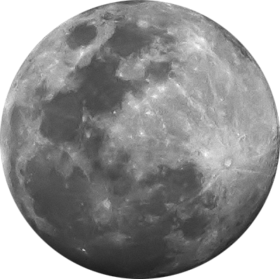
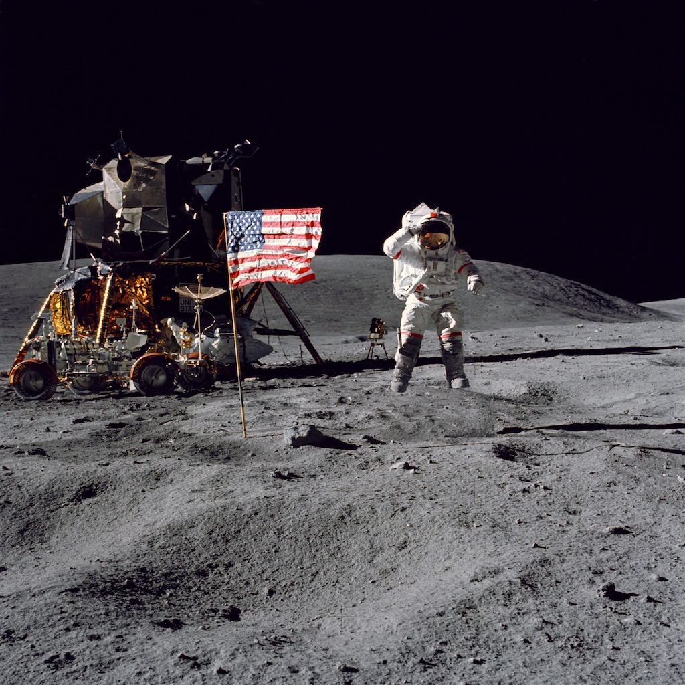
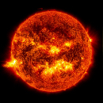
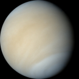
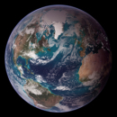
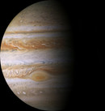
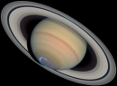
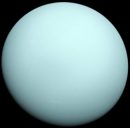

 * [Solar System](#)
   * [Our Sun](#our-sun)
   * [Terrestrial Planets](#terrestrial-planets)
     * [Mercury](#mercury)
     * [Venus](#venus)
     * [Earth](#earth)
       * [The Moon](#the-moon)
     * [Mars](#mars)
   * [Joivan Planets](#jovian-planets)
     * [Jupiter](#jupiter)
     * [Saturn](#saturn)
     * [Uranus](#uranus)
     * [Neptune](#neptune)
 * [Additional Resources](#additional-resources)
 * [Test Yourself](#test-yourself)

<small>Click on an object to jump to it:</small>

<map name="navigation">
    <area shape="rect" coords="0,0,168,634" href="#our-sun" title="Our Sun" alt="Our Sun" />
    <area shape="circle" coords="218,315,27" href="#mercury" title="Mercury" alt="Mercury" />
    <area shape="circle" coords="324,315,39" href="#venus" title="Venus" alt="Venus" />
    <area shape="circle" coords="464,315,50" href="#earth" title="Earth" alt="Earth" />
    <area shape="circle" coords="508,256,13" href="#the-moon" title="The Moon" alt="The Moon" />
    <area shape="circle" coords="604,315,35" href="#mars" title="Mars" alt="Mars" />
    <area shape="rect" coords="700,95,1000,532" href="#jupiter" title="Jupiter" alt="Jupiter" />
    <area shape="rect" coords="1060,220,1350,420" href="#saturn" title="Saturn" alt="Saturn" />
    <area shape="circle" coords="1500,315,98" href="#uranus" title="Uranus" alt="Uranus" />
    <area shape="circle" coords="1710,315,74" href="#neptune" title="Neptune" alt="Neptune" />
    <area shape="default" alt="The Solar System"/>
</map>

<audio class="audio">
  <source src="speech/solarsystem.wav" type="audio/wav">
Your browser does not support this audio format (wav).
</audio>

There are two basic types of planets, Earth-like (Terrestrial) planets and Jupiter-like (Jovian) planets. The Terrestrial planets are small, dense, rocky worlds. They are located in the inner part of the Solar System, they have solid surfaces, just a couple moons at most, rotate slowly, and have no rings around them.

The Jovian planets are large planets located in the outer part of the Solar System. The Jovian planets are gas giants, large objects made mostly of hydrogen and helium. They are much larger than terrestrial planets and are rapidly rotating objects. They all have rings, and extensive families of moons and no solid surface on which to stand on. The apparent visible surfaces are just the top layers of clouds in their atmospheres.

## Our Sun

<audio class="audio">
  <source src="speech/sun.wav" type="audio/wav">
Your browser does not support this audio format (wav).
</audio>

The Sun is the center star of our Solar System. All of the planets, asteroids and comets revolve around the Sun. The Sun’s role as the center of the system comes from its high mass. It has 99.8% of the mass in the Solar System. The sun is a star, a hot ball of glowing gases. Without the sun's intense energy and heat, there would be no life on Earth. And though it is special to us, there are billions of stars like our sun scattered across the Milky Way galaxy.

### Quick Facts

Type|Star|G2V
Luminosity|3.83 x 1033 ergs/sec|
Visual Brightness (V)|-26.74|
Absolute Magnitude|4.83|
Composition|92.1% Hydrogen, 7.8% Helium|
Temperature|5,504 °C|5777 K
Mass|1.989 x 1030 kg|333,060.402 x Earth
Equatorial Radius|695,508 km|109.2 x Earth|
Gravity|274.0 m/s2|
Mean Rotation Period|25.38 Earth Days|609.12 Hours
Age|4.6 Billion Years|

<!-- Escape Velocity|2,223,720 km/h|6.177 x 105 m/s -->

# Terrestrial Planets:

## Mercury

<audio class="audio">
  <source src="speech/mercury.wav" type="audio/wav">
Your browser does not support this audio format (wav).
</audio>

Mercury is the closest planet to the Sun and smallest of the terrestrial planets. It has a very thin atmosphere, which is only a little more substantial than a vacuum.

### Quick Facts

Type|Terrestrial|
Mass|3.3010 x 1023 kg|0.055 x Earth
Diamiter|4,879 km|
Gravity|3.7 m/s2|
Surface Temperature|-173 to + 427 °C|100 to 700 K
Rotation Period|58.646 Earth Days|1407.5 Hours
Atmosphere|vacuum|
Ring System?|No|
Global Magnetic Field?|Yes|
No. of Moons|0|
Mean Distance from Sun|57,909,227 km|0.38709927 AU
Mean Orbit Velocity|170,503 km/h|4.7362 x 104 m/s
Orbit Period|88 Earth Days|

<!--- Escape Velocity|15,300 km/h|4.25 x 103 m/s -->
<!--- Axial Tilt|0.01 degrees| -->
<!--- Orbital Inclination|7 degrees| -->

## Venus

<audio class="audio">
  <source src="speech/venus.wav" type="audio/wav">
Your browser does not support this audio format (wav).
</audio>

Venus has a very thick atmosphere mostly composed of carbon dioxide gas. The thick carbon dioxide atmosphere traps heat from the Sun during the day and does not let the surface cool at night. The high temperature and unbreathable thick atmosphere would make the planet very inhospitable to human visitors.

### Quick Facts

Type|Terrestrial|
Mass|4.8673 x 1024 kg
Diamiter|12,104 km|
Gravity|8.87 m/s2|
Surface Temperature|462 °C|735 K
Rotation Period|-243.018 Earth Days|-5832.4 Hours
Atmosphere|Carbon Dioxide, Nitrogen| CO2, N2
Ring System?|No|
Global Magnetic Field?|No|
No. of Moons|0|
Mean Distance from Sun|108,209,475 km|0.72333566 AU
Mean Orbit Velocity|126,074 km/h|3.5020 x 104 m/s
Orbit Period|224.7 Earth Days|

<!--- Escape Velocity|37,296 km/h|1.036 x 104 m/s -->
<!--- Axial Tilt|0.007 degrees| -->
<!--- Orbital Inclination|3.4 degrees| -->

## Earth

<!-- <video width="852" height="480" autoplay loop>
	<source src="img/earth.mp4" type="video/mp4">
    <source src="img/earth.webm" type="video/webm">
	<source src="img/earth.ogv" type="video/ogg">
</video> -->

<audio class="audio">
  <source src="speech/earth.wav" type="audio/wav">
Your browser does not support this audio format (wav).
</audio>

Earth is our home planet. Most of its surface (over 70%) is covered with oceans, with the remainder featuring a wide variety of land forms, from mountains and valleys to plains and beaches. Earth has a thick atmosphere, which is mostly nitrogen (78%) and oxygen (21%). The region on and below the surface of Earth is filled with life which makes this planet unique.

### Quick Facts

Type|Terrestrial|
Mass|5.9722 x 1024 kg
Diamiter|12,756 km|
Gravity|9.80665 m/s2|
Surface Temperature|-88 to + 58 °C|185 to 331 K
Rotation Period|0.99726968 Earth Days|23.934 Hours
Atmosphere|Nitrogen, Oxygen| N2, O2
Ring System?|No|
Global Magnetic Field?|Yes|
No. of Moons|1|
Mean Distance from Sun|149,598,262 km|1 AU
Mean Orbit Velocity|107,218 km/h|2.9783 x 104 m/s
Orbit Period|1 Earth Years|365.2 Earth Days

<!--- Escape Velocity|40,284 km/h|1.119 x 104 m/s -->
<!--- Axial Tilt|23.4393 degrees| -->
<!--- Orbital Inclination|0 degrees| -->

### The Moon

<audio class="audio">
  <source src="speech/moon.wav" type="audio/wav">
Your browser does not support this audio format (wav).
</audio>

The moon revolves around Earth and determines Earth's tides. The Moon is our natural satellite. So far is the only object in space humans have travelled to. Neil Armstrong is the first human to step on the moon on 20th of July 1969:

#### Quick Facts

Mass|7.3477 x 1022 kg
Diamiter|3,475 km|
Gravity|1.624 m/s2|0.166 x Earth
Surface Temperature|-233 to +123 °C|40 to 396 K
Rotation Period|27.322 Earth Days|655.73 Hours
Mean Distance from Earth|384,400 km|0.00257 AU
Mean Orbit Velocity|3,680.5 km/h|1,022 m/s
Orbit Period|0.074803559 Earth Years|27.322 Earth Days

<!--- Escape Velocity|8640 km/h| 2.4 x 103 m/s -->
<!--- Axial Tilt|6.68 degrees| -->
<!--- Orbital Inclination|5.1 degrees| -->

## Mars

<audio class="audio">
  <source src="speech/mars.wav" type="audio/wav">
Your browser does not support this audio format (wav).
</audio>

Mars is about half the size of Earth in diameter. Mars has a carbon dioxide atmosphere, but it is extremely thin. The thin air does not retain heat well. Mars has polar ice caps, made of water ice and carbon dioxide ice. The Martian surface has features that look like dry stream-beds, leading many researchers to suspect that at some time in the distant past, Mars may have had liquid water flowing on its surface.

### Quick Facts

Type|Terrestrial|
Mass|6.4169 x 1023 kg
Diamiter|6,792 km|
Gravity|3.71 m/s2|
Surface Temperature|-153 to +20 °C|120 to 293 K
Rotation Period|1.026 Earth Days|24.623 Hours
Atmosphere|Carbon Dioxide, Nitrogen, Argon|CO2, N2, Ar
Ring System?|No|
Global Magnetic Field?|No|
No. of Moons|2|
Mean Distance from Sun|227,943,824 km|1.523662 AU
Mean Orbit Velocity|86,677 km/h|2.4077 x 104 m/s
Orbit Period|687 Earth Days|

<!--- Escape Velocity|18,108 km/h|5.030 x 103 m/s -->
<!--- Axial Tilt|25.2 degrees| -->
<!--- Orbital Inclination|1.9 degrees| -->

# Jovian Planets:

## Jupiter

<audio class="audio">
  <source src="speech/jupiter.wav" type="audio/wav">
Your browser does not support this audio format (wav).
</audio>

Jupiter is the largest planet in the Solar System. It is about 318 times as massive as Earth, and over 1,300 Earths could fit inside of it. Like all Jovian planets, Jupiter’s surface shows complicated wind patterns. Perhaps the most recognizable feature on Jupiter’s surface is the Great Red Spot, a huge storm, twice the diameter of Earth, which has been going on for at least 300 years.

### Quick Facts

Type|Jovian|
Mass|1.8981 x 1027 kg
Diamiter|142,984 km|
Gravity|24.79 m/s2|
Temperature|-148 °C|125 K
Rotation Period|0.41354 Earth Days|9.92496 Hours
Atmosphere|Hydrogen, Helium|H2, He
Ring System?|Yes|
Global Magnetic Field?|Yes|
No. of Moons|67|
Mean Distance from Sun|778,340,821 km|5.2028870 AU
Mean Orbit Velocity|47,002 km/h|1.3056 x 104 m/s
Orbit Period|4,331 Earth Days|

<!--- Escape Velocity|216,720 km/h|6.020 x 104 m/s -->
<!--- Axial Tilt|3.1 degrees| -->
<!--- Orbital Inclination|1.3 degrees| -->

## Saturn

<audio class="audio">
  <source src="speech/saturn.wav" type="audio/wav">
Your browser does not support this audio format (wav).
</audio>

Saturn is just a little smaller than Jupiter (its diameter is about 85% of Jupiter’s) but a lot lighter (its mass is about a third of Jupiter’s). This means that it has a very low density. In fact, its density is the lowest of all the planets and less than the density of water. In composition and internal structure, the planet is thought to be fairly similar to its larger sibling, Jupiter.

All Jovian planets are surrounded by a complex ring system made of icy particles. Saturn’s ring system is, by far, the most spectacular. The rings of the other Jovian planets are much thinner and fainter.

### Quick Facts

Type|Jovian|
Mass|5.6832 x 1026 kg
Diamiter|120,536 km|
Gravity|\*10.4 m/s2|
Temperature|-178 °C|95 K
Rotation Period|0.444 Earth Days|10.656 Hours
Atmosphere|Hydrogen, Helium|H2, He
Ring System?|Yes|
Global Magnetic Field?|Yes|
No. of Moons|62|
Mean Distance from Sun|1,426,666,422 km|9.53667594 AU
Mean Orbit Velocity|34,701 km/h|9.6391 x 103 m/s
Orbit Period|10,747 Earth Days|

<!--- Escape Velocity|129,924 km/h|3.609 x 104 m/s -->
<!--- Axial Tilt|26.7 degrees| -->
<!--- Orbital Inclination|2.5 degrees| -->
<small>\* Derived from a 1 bar radius of 60,268 km.<small>

## Uranus

<audio class="audio">
  <source src="speech/uranus.wav" type="audio/wav">
Your browser does not support this audio format (wav).
</audio>

Uranus’s unique feature is that it appears to have been knocked over sometime in the past. Spinning perpendicular to it's orbit. Most planets orbit around the Sun spinning upright. The cause of this is not yet certain, but it has been suggested that it was caused by an impact of a large object, such as a large asteroid or moon. Giant impacts like this were common during the early history of the Solar System; a similar impact is thought to have created the Earth’s Moon.

### Quick Facts

Type|Jovian|
Mass|8.6810 x 1025 kg
Diamiter|51,118 km|
Gravity|8.87 m/s2|
Temperature|-216 °C|57 K
Rotation Period|-0.718 Earth Days|-17.23992 Hours
Atmosphere|Hydrogen, Helium, Methane|H2, He,  CH4
Ring System?|Yes|
Global Magnetic Field?|Yes|
No. of Moons|27|
Mean Distance from Sun|2,870,658,186 km|19.189165 AU
Mean Orbit Velocity|24,477 km/h|6.7991 x 103 m/s
Orbit Period|30,589 Earth Days|

<!--- Escape Velocity|76,968 km/h|2.138 x 104 m/s -->
<!--- Axial Tilt|97.8 degrees| -->
<!--- Orbital Inclination|0.8 degrees| -->

## Neptune

<audio class="audio">
  <source src="speech/neptune.wav" type="audio/wav">
Your browser does not support this audio format (wav).
</audio>

Neptune is similar in size to Uranus. Giant storm centers can be seen on its visible surface, similar to those on the other Jovian planets. The atmosphere features great wind patterns; its winds are the fastest in the Solar System, reaching speeds of 2,000 km/hour (or 1,200 miles/hour).

### Quick Facts

Type|Jovian|
Mass|1.0241 x 1026 kg
Diamiter|49,528 km|
Gravity|11.15 m/s2|
Temperature|-214 °C|59 K
Rotation Period|0.671 Earth Days|16.11000 Hours
Atmosphere|Hydrogen, Helium, Methane|H2, He,  CH4
Ring System?|Yes|
Global Magnetic Field?|Yes|
No. of Moons|14|
Mean Distance from Sun|4,498,396,441 km|30.069923 AU
Mean Orbit Velocity|19,566 km/h|5.4349 x 103 m/s
Orbit Period|59,800 Earth Days|

<!-- Escape Velocity|84,816 km/h|2.356 x 104 m/s -->
<!-- Axial Tilt|28.3 degrees| -->
<!-- Orbital Inclination|1.8 degrees| -->

# Additional Resources

[Earth at night as seen from ISS](https://vimeo.com/32001208)

[Solar Flares](https://vimeo.com/124139626)

[Earth 360 degrees](http://earth.plus360degrees.com/)

[Jupiter](https://www.youtube.com/watch?v=3afEX8a2jPg)

[stars.chromeexperiments.com](http://stars.chromeexperiments.com/)

[joshworth.com/dev/pixelspace/pixelspace_solarsystem.html](http://joshworth.com/dev/pixelspace/pixelspace_solarsystem.html)

[NASA Eyes simulation](http://eyes.nasa.gov)

# Test Yourself
Match the names with the images.

    

        
Sun

        
Mercury

        
Venus

        
Earth

        
Mars

        
Jupiter

        
Saturn

        
Uranus

        
Neptune

    

    

        

            

            

        

        

            

            

        

        

            

            

        

        

            

            

        

        

            

            

        

        

            

            

        

        

            

            

        

        

            

            

        

        

            

            

        

    

