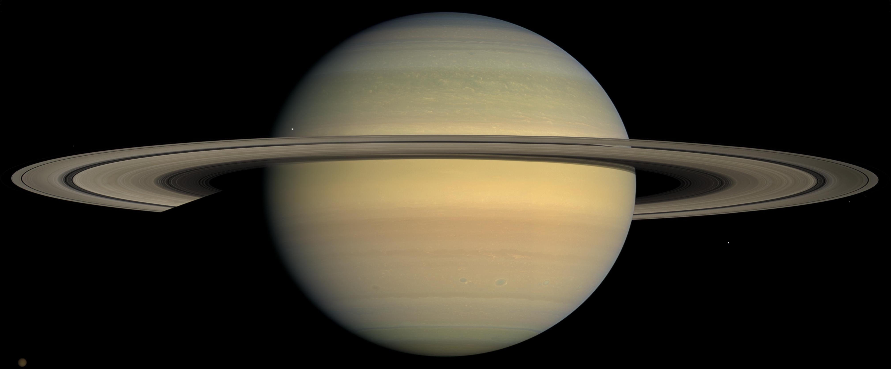

<map name="navigation">
    <area shape="rect" coords="0,0,168,634" href="#our-sun" title="Our Sun" alt="Our Sun" />
    <area shape="circle" coords="218,315,27" href="#mercury" title="Mercury" alt="Mercury" />
    <area shape="circle" coords="324,315,39" href="#venus" title="Venus" alt="Venus" />
    <area shape="circle" coords="464,315,50" href="#earth" title="Earth" alt="Earth" />
    <area shape="circle" coords="604,315,35" href="#mars" title="Mars" alt="Mars" />
    <area shape="rect" coords="700,95,1000,532" href="#jupiter" title="Jupiter" alt="Jupiter" />
    <area shape="rect" coords="1060,220,1350,420" href="#saturn" title="Saturn" alt="Saturn" />
    <area shape="circle" coords="1500,315,98" href="#uranus" title="Uranus" alt="Uranus" />
    <area shape="circle" coords="1710,315,74" href="#neptune" title="Neptune" alt="Neptune" />
    <area shape="default" nohref="nohref"/>
</map>

There are two basic types of planets, Earth-like ("terrestrial") planets and Jupiter-like ("Jovian") planets. The terrestrial planets are Mercury, Venus, Earth and Mars. They are small, dense, rocky worlds. They are located in the inner part of the Solar System, they have solid surfaces, just a couple moons at most, rotate slowly, and have no rings around them.

The Jovian planets are Jupiter, Saturn, Uranus and Neptune. They are large planets located in the outer part of the planetary realm of the Solar System. The Jovian planets are gas giants—large objects made mostly of hydrogen and helium. They are much larger than terrestrial planets. They are rapidly rotating objects. They all have rings, and extensive families of moons. They have no solid surface on which to stand, and the apparent visible surfaces are just the top layers of clouds in their atmospheres. Deeper in their atmospheres, the gases get thicker and thicker, until finally they turn into a liquid. At their centers, they may have a solid, rocky core a few times the size of Earth.

## Our Sun

### Description

The Sun is at the center of the Solar System. The planets, asteroids and comets all revolve around the Sun. The Sun’s role as the center of the planetary system comes from its high mass; it has 99.8% of the mass in the Solar System. The Sun is a star.

### Quick Facts

# Terrestrial Planets:

## Mercury

### Description

Mercury is the closest planet to the Sun and smallest of the terrestrial planets. It has a very tenuous atmosphere, which is only a little more substantial than a vacuum. Sunlight heats up the surface of the planet to high temperatures during the day, up to 450ºC (840ºF). At night, the surface cools off rapidly, and the temperatures can drop down to -180ºC (-300ºF).

### Quick Facts

## Venus

### Description

Venus has a very thick atmosphere mostly composed of carbon dioxide gas. The thick carbon dioxide atmosphere traps heat from the Sun during the day and does not let the surface cool at night; as a result, temperatures on the Venusian surface are over 464ºC (867º F). The high temperature and unbreathable thick atmosphere would make the planet very inhospitable to human visitors.

### Quick Facts

## Earth

### Description

Earth is our home planet. Most of its surface (over 70%) is covered with oceans, with the rest featuring a wide variety of land forms, from mountains and valleys to plains and beaches. Earth has a thick atmosphere, which is mostly nitrogen (78%) and oxygen (21%). The region on and below the surface of Earth is filled with life which makes this planet unique.

### Quick Facts

## Mars

### Description

Mars is about half the size of Earth in diameter. Mars has a carbon dioxide atmosphere, but it is extremely thin. The thin air does not retain heat well, and surface temperatures range from a frigid -130ºC (-200ºF) on a cold winter night to 27ºC (80ºF) at the equator on a hot summer day. Mars has polar ice caps, made of water ice and carbon dioxide ice. The Martian surface has features that look like dry streambeds, leading many researchers to surmise that at some time in the distant past, Mars may have had liquid water flowing on its surface.

### Quick Facts

# Jovian Planets:

## Jupiter

### Description

### Quick Facts

## Saturn

### Description

### Quick Facts

## Uranus

### Description

### Quick Facts

## Neptune

### Description

### Quick Facts

# Additional Resources

[Solar Flares](https://vimeo.com/124139626)

[Earth at night as seen from ISS](https://vimeo.com/32001208)

[Earth 360 degrees](http://earth.plus360degrees.com/)

[Jupiter](https://www.youtube.com/watch?v=3afEX8a2jPg)

[stars.chromeexperiments.com](http://stars.chromeexperiments.com/)

[joshworth.com/dev/pixelspace/pixelspace_solarsystem.html](http://joshworth.com/dev/pixelspace/pixelspace_solarsystem.html)

[NASA Eyes simulation](http://eyes.nasa.gov)

## Quiz
Match the names with the images.

    

        
Sun

        

        
Mercury

        

        
Venus

        

        
Earth

        

        
Mars

        

        
Jupiter

        

        
Saturn

        

        
Uranus

        

        
Neptune

        

    

    

        
Sun

        
Mercury

        
Venus

        
Earth

        
Mars

        
Jupiter

        
Saturn

        
Uranus

        
Neptune

    

