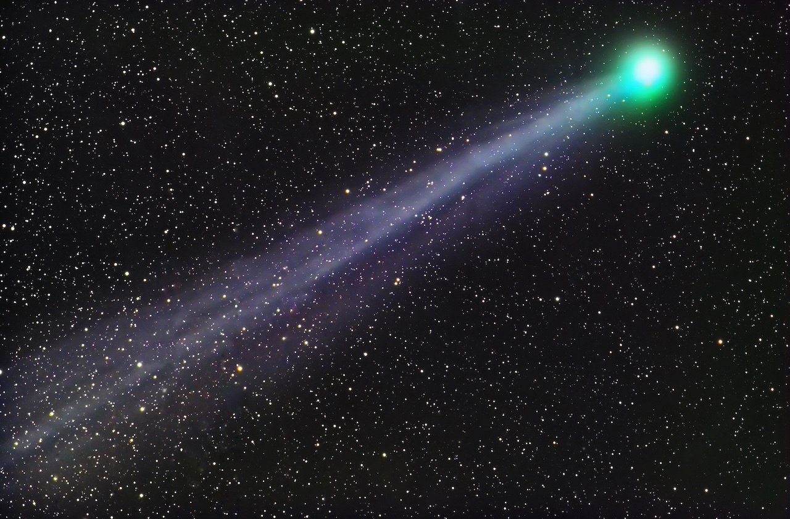
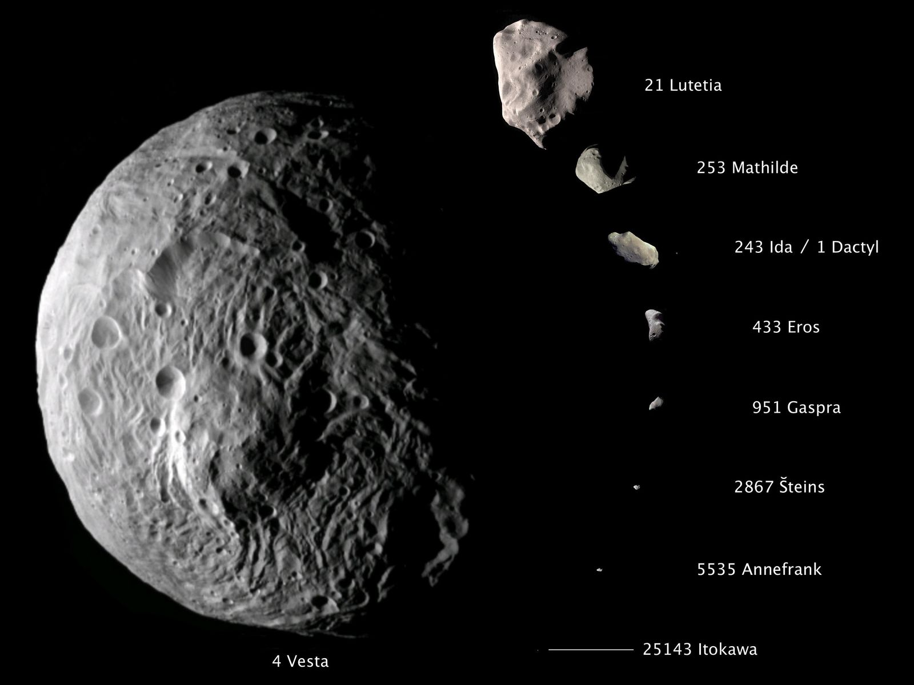
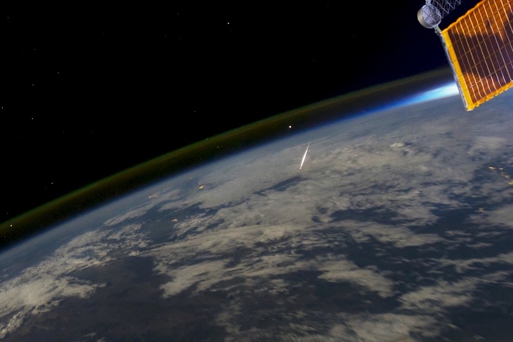
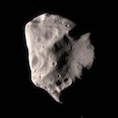
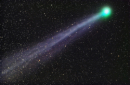
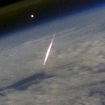

* [Small-Bodies](#)
  * [Comets](#comets)
  * [Asteroids](#asteroids)
  * [Meteors and Meteorites](#meteors-and-meteorites)
* [Test Yourself](#test-yourself)

## Comets

<audio class="audio">
  <source src="speech/comets.wav" type="audio/wav">
Your browser does not support this audio format (wav).
</audio>

The outer regions of the Solar System are home to the comets: dirty ice balls composed of ices (water ice, carbon dioxide, ammonia, and methane ices), rock, and dust. They are thought to be remnants of or the actual building blocks of the outer planets. Comets spend most of their time in the outer reaches of the Solar System and are therefore invisible to observers on Earth. At this point, the comet consists of only its solid body, the nucleus, which is only a few kilometers across and darker than charcoal. It is only when a comet’s orbit takes it to the inner parts of the Solar System that a comet becomes observable. The Sun heats the frozen body of the comet, and causes ices on the comet’s surface to sublimate (change directly from solid to gas). The resulting gas and dust particles around the nucleus form a large cloud called the coma. Comet’s coma can be over 1.6 million km in size. Sunlight pushes against the dust particles in the coma, while the solar wind (a stream of electronically charged particles from the sun) interacts with the gas. As a result, material in the coma is pushed away from the nucleus, forming the third component of the comet, its tail. It is not unusual for the tails of comets to extend tens of millions of km. If comets venture close to Earth, they can be some of the most striking objects in the sky. Comets with an orbital period of less than 200 years are thought to come from the Kuiper Belt.

## Asteroids

<audio class="audio">
  <source src="speech/asteroids.wav" type="audio/wav">
Your browser does not support this audio format (wav).
</audio>

Asteroids are small rocky objects in the Solar System. They orbit the Sun like planets, but they are a lot smaller. The largest asteroid, Ceres, is a little over 900 km in diameter. There are hundreds of thousands of known asteroids. Astronomers probably have seen almost all of the asteroids larger than 100 km, and about half of those with diameters in the 10-100 km range. But there are probably millions of asteroids with sizes in the 1 km range that have never been seen. Most of the asteroids orbit the Sun in the Asteroid Belt, a region between the orbits of Mars and Jupiter. Some of the moons (such as Mars’s moons and the outer moons of Jupiter and Saturn) are similar to asteroids, and may actually be captured asteroids rather than having formed in the same way around the planet as the other moons.

## Meteors and Meteorites

<audio class="audio">
  <source src="speech/meteors.wav" type="audio/wav">
Your browser does not support this audio format (wav).
</audio>

Sometimes asteroids collide with each other and pieces of them break off. These pieces of broken-off rock (sometimes called meteoroids) travel around the Solar System, and on occasion they may cross paths with Earth and hit the planet. When they fall through the Earth’s atmosphere, they can be seen as "shooting stars" in the sky as the rocks burn up. If the rock is sufficiently large, part of it may survive the flight through the atmosphere and fall to the ground. These pieces are then called meteorites. Most of the meteorites come from asteroids, but some are thought to have come from the Moon or Mars, blasted off from their surface by big meteoroid impacts.

Comets leave trails of debris in their wake as they travel through the inner part of the Solar System. When Earth passes through these trails of dust and ice on its orbit around the Sun, the particles can hit the Earth and burn up in the atmosphere. These events can be observed from the surface of Earth as meteor showers.

# Test Yourself
Match the names with the images.

    

        
Asteroid

        
Comet

        
Meteor

    

    

        

            

            

        

        

            

            

        

        

            

            

        

    

