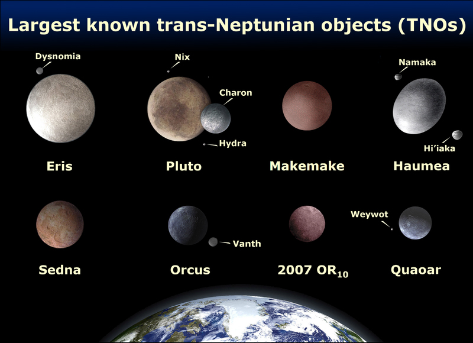

<audio class="audio">
  <source src="speech/kuiper-belt.wav" type="audio/wav">
Your browser does not support this audio format (wav).
</audio>

## Pluto

Discovered in 1930, Pluto was long considered our solar system's ninth planet. But after the discovery of similar intriguing worlds deeper in the distant Kuiper Belt, icy Pluto was reclassified as a dwarf planet in 2006. This new class of worlds may offer some of the best evidence about the origins of our solar System.

## Kuiper Belt

The Kuiper Belt is a disc-shaped region of icy bodies (including dwarf planets such as Pluto) and comets beyond the orbit of Neptune. It extends from about 30 to 55 AU and is probably populated with hundreds of thousands of icy bodies larger than 100 km across and an estimated trillion or more comets. The first Kuiper Belt Object was discovered in 1992.

## Star Life-cycle

After a star birth, planets should form as natural by-products.

# Additional Resources
[Blackhole swallows a star](https://www.youtube.com/watch?v=hu6hIhW00Fk)

<!-- lunar missions: news twitter feed. -->
