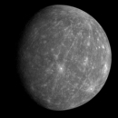
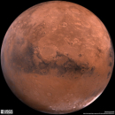
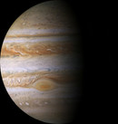
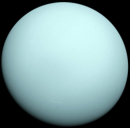

## Test Yourself
Match the names with the images.

    

        
Sun

        
Mercury

        
Venus

        
Earth

        
Mars

        
Jupiter

        
Saturn

        
Uranus

        
Neptune

        
Asteroid

        
Comet

        
Meteor

    

    

        

            

            

        

        

            

            

        

        

            

            

        

        

            

            

        

        

            

            

        

        

            

            

        

        

            

            

        

        

            

            

        

        

            

            

        

        

            

            

        

        

            

            

        

        

            

            

        

    

### Model the Solar System
Model the solar system by dragging the images to the corresponding places:

    

        

        

        

        

        

        

        

        

        

    

    

        

        

        

        

        

        

        

        

        

    

