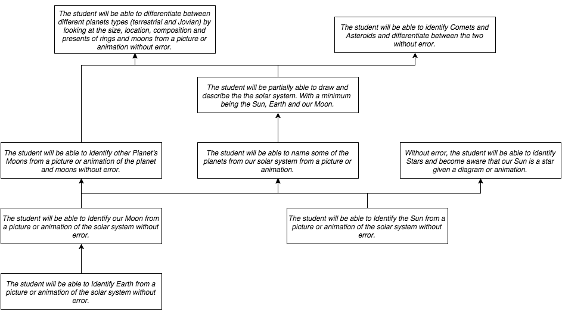

Student Name: Sebastian Schmidt

Student Number: s2894777

## Learning Objectives Draft

|-|-|
|Topic|Solar System|
|Topic Overview||
|Ideas for visual styles, colors or interactive components:|2D Animation/simulation of the Solar System in HTML/CSS/JS using WebGL ([goocreate.com](http://goocreate.com))|
|Target Audience:|5 - 7|
|User Skills (assumed)|Ability to differentiate between shapes, size and color. Able to read. Know that the earth is round. Ability to use a tablet (android/iOS) or web browser|
|Skills they may not have|Ability to judge small distances (relatively speaking, earth distances)|
|Delivery Mode|Website|
|Software Requirements|A modern web browser with Javascript and WebGl capabilities|
|Technical Constraints|A GPU capable of displaying WebGL content. Must be viewable on a tablet(touch devices)|
|Previous Attempts|n/a|
|Lessons Learnt from Others Attempts|n/a|
|Learning Object overall Goals:|Learn the Solar System|
|Learning specific Objectives:|The student will be able to Identify the Sun from a picture or animation of the solar system without error. Without error, the student will be able to identify Stars and become aware that our Sun is a star given a diagram or animation. The student will be able to Identify Earth from a picture or animation of the solar system without error. The student will be able to name some of the planets from our solar system from a picture or animation. The student will be partially able to draw and describe the the solar system. With a minimum  being the Sun, Earth and our Moon. The student will be able to Identify our Moon from a picture or animation of the solar system without error. The student will be able to Identify other Planet’s Moons from a picture or animation of the planet and moons without error. The student will be able to Identify our Solar System from a picture or animation of a number of systems, without error The student will be able to identify Comets and Asteroids and differentiate between the two without error. The student will be able to differentiate between different planets types (terrestrial and Jovian) by looking at the size, location, composition and presents of rings and moons from a picture or animation without error.|
|Topic Concepts your Learning object will teach:|Where we are in relation to the sun and the Moon. Try to answer the question “What is up in the sky?”|
|Learning Theories informing your design:|Cognitive|
|Will you use some Interface Metaphors?|Yes, maybe plus and minus buttons for zoom, icons for Celestial Objects and a speaker for sound|
|Will you use Scaffolding (what kind)?|Yes, illustrations|
|Testing Users Knowledge|Drag & Drop Quizzes|

## Objectives Chart

Comments: I aim to primarily present the content in a visual style. And In a Hierarchical learning style.

## Learning Objectives

|Topic|Solar System|
|Time| 2 hours|
|Audience| 5-7 year olds, Male and Female, basic primary school Knowledge required, can be completed at home or school, A tablet or computer with a modern browser is required, a quiet room or class room environment is recommended|
|Goals|Where we are in relation to the sun and the Moon. Try to answer the question “What is up in the sky?” |
|Objectives||

|Learning Style|Visual and Text by using description, illustrations and simulations|
|Learning Theory|Cognitivism|

|Content|Solar System, Planets and Moons, Comets & Asteroids, Stars|
|Content Design||
|Design of the Learning Process||
